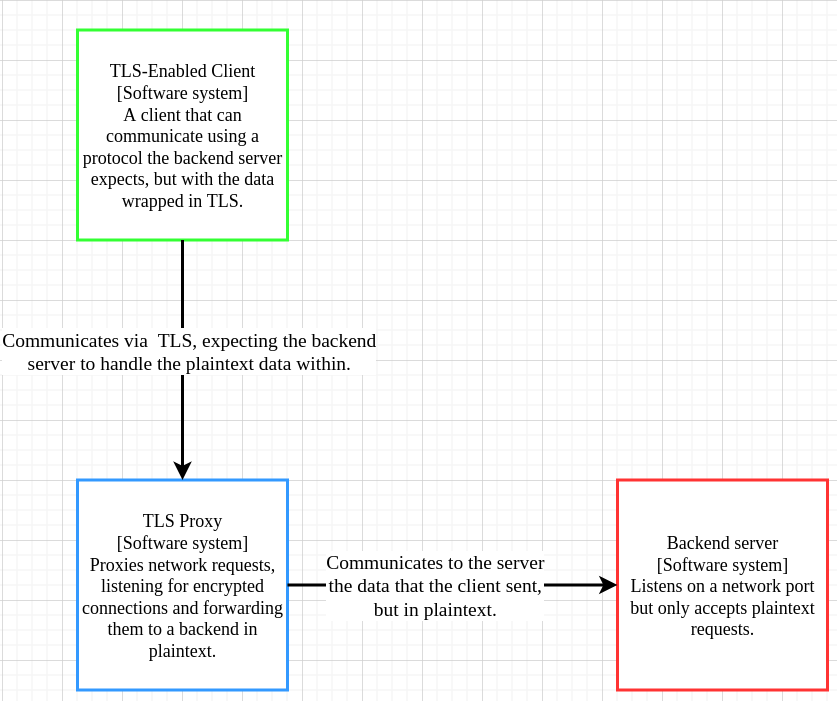
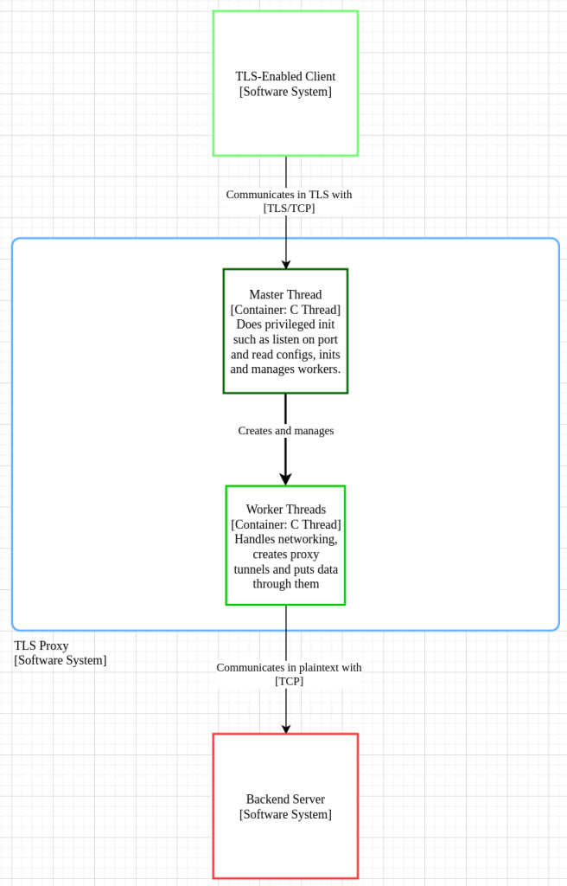

# TLS Proxy Architecture

## Introduction

This TLS proxy is a small project I'm doing to practice software design, with its architecture strongly influenced by nginx's really nice event-based architecture. It's pretty much just stunnel, but implemented on an epoll-based event loop.

## Definitions

- **Client**: Refers to the program connecting over a network via TLS to the TLS Proxy.
- **(Backend) Server**: Refers to the program that the TLS proxy connects to in plaintext upon request of the client.

## Requirements

### Functional

1. This program must listen for TLS connections on a port, and whenever it receives one make a connection to a backend server, forwarding the decrypted packets to it.
2. The backend server must see the connection as plaintext.
3. The client must see the connection as TLS-tunneled.
4. The program must be configurable with a configuration file.
5. The program must be runnable as a daemon with privsep and chroot.
6. The program must run on modern Linux machines.

### Non-functional

1. This program must support the most up-to-date security measures in TLS (such as MLKEM-ed25519 hybrid TLS groups).
2. This program must handle more than 80% of the connections per second that `stunnel` handles.
3. It should perform error checking and be able to recover from most errors.

## Constraints

1. The deadline is the 14th of December, 2025.
2. The developer only knows C, C++, Python, and Haskell to a reasonable enough extent.
3. The developer is most familiar with OpenSSL, which is a C library.

## Architecture

### System context



### Component diagram



## Design decisions

### Programming language

This project will be completed in C, mainly for performance reasons. If this project is aiming to be faster than stunnel, it has to avail itself of all advantages possible, especially the low-hanging fruit such as this. C was also chosen over many interpreted languages due to its low-level epoll interface, and while I could have used C++ for this, C is frankly much simpler to optimize when the C++ compilers are considered, and this project has a 2 week deadline.

### Process/Concurrency model

This project's process and concurrency model is based heavily on nginx's, as is virtually every server hoping for both HA and performance, such as Envoy Proxy. This process model has a main process which initializes the shared memory, listens on the socket, drops privileges, and creates the workers, which are child processes. Then, it just waits for signals which it can use to control the workers. The workers each have a central event loop, in which each proxy connection uses the proxy state machine. The event loop will also handle timeouts in a similar way as nginx, which does them quite intelligently: using red-black trees to store timeouts so that the nearest one is always available in O(log(n)) time.

### High Availability

**UNDECIDED**. How can I make this live forever? There are a few things that `nginx` does that hint to me that malloc fragmentation would give this program a bit of grief, such as use custom slab and pool allocators. I think those are also for cache optimization, though.

### Performance

There are a few considerations for speed. One is that the session cache for resumption should by all means shared through all processes, but in the interest of time I may need to skip this. If I can work fast enough, this can be done, but otherwise I will have to do with either no session cacheing or per-process caches, which will both be slow, so I may as well disable cacheing if I'm not going to implement it in shared memory.

### Configuration

This will just use a simple YAML configuration file for now. As of now not much configurability is to be implemented, due to time constraints. The configuration will be as so:


```yaml
## Connection details of the backend server
target-ip: localhost
target-port: 80

## The proxy will accept connections on <listen-ip>:<listen-port>
## 0.0.0.0 means listen on every interface
listen-ip: 0.0.0.0
listen-port: 443

## The certificate chain offered to clients
cacerts:
- root.pem
- intermediate.pem
servcert: servcert.pem
servkey: servkey.pem

## Alternatively, provide all certs (including server cert) in a single file:
# cert-chain: chain.pem
# servkey: servkey.pem
## cacerts and servcert are mutually exclusive with cert-chain.

## If we implement mTLS:
# trusted-certs:
# - clientroot.pem
## In this example, only the root is provided. If your client doesn't send the
## chain certs, you will need to include the intermediate certs here.
## Also, if the client cert is self-signed or you don't have its chain, just
## put it in here.
```

### Documentation

I'll just use Doxygen, maybe make a CI step in GitHub to upload it to GitHub Pages.

### Testing

I'll try to focus on unit testing with CMocka, though I will do performance benchmarking in other ways (TODO: research). https://github.com/tempesta-tech/tls-perf seems to be a good TLS benchmarking tool, though I may not be able to use it as it would probably shut down the connection before the server socket gets a chance to connect to the backend.


## General Code model

### Main

In the parent process, this will read the config files, initialize shared memory, and start the worker processes, then wait for signals. In the child processes, this will listen on the proxy socket with SO_REUSEPORT, drop privileges, post a socket read event, then go into the main event loop.

### Proxy

In general, the proxy is a state machine created when a connection is accepted on the listen socket. It will go something like this:
- Client connected
- Sockets connected
- Client disconnected
- Server disconnected
- Proxy error
- Done

The proxy will be created once the client fully finishes its TLS handshake and is fully connected and authenticated. So, the first state is "Client connected". Once the server is connected, the "Sockets connected" state says that read and write operations can now be done. Next, when one side disconnects or the proxy errors, we make sure to shut down all sockets and then proceed to the "Done" state. Depending on when the proxy is deleted, the "Done" state may not be needed. Both the client and server sockets are stored in the proxy context.

### Socket

Both plain and TLS sockets will have their own wrappers, the TLS one bundling some OpenSSL context along with the TLS socket, and for both plain and TLS sockets, some read and write callbacks.
